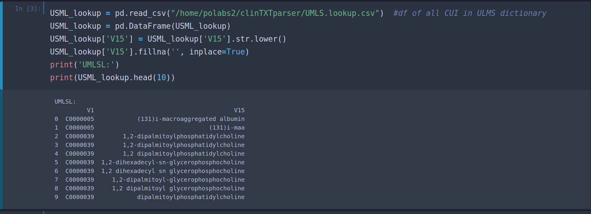
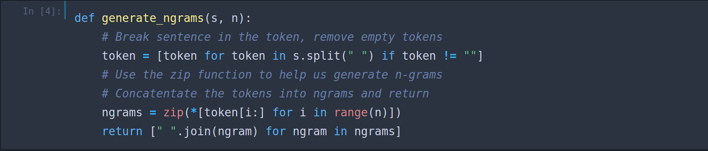
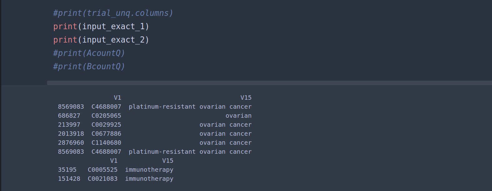
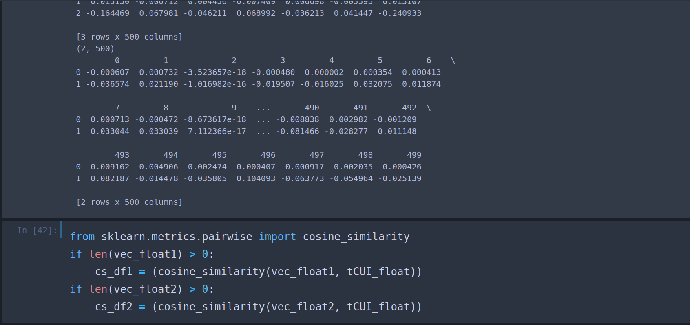
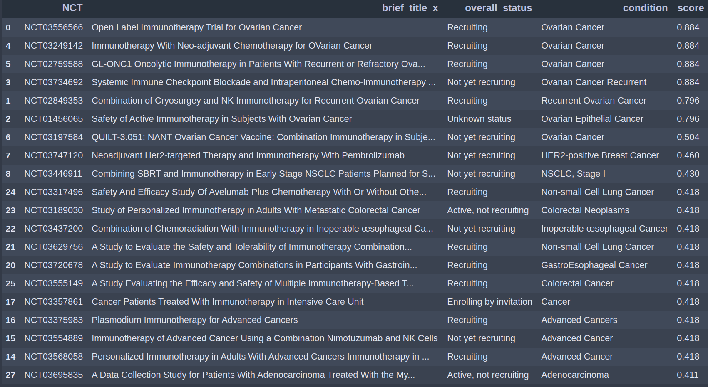

# **Clinical_Trial_Search**
NLP powered trial search using ClinTrials.gov database

&nbsp;&nbsp;&nbsp;&nbsp;&nbsp;&nbsp;&nbsp;The Clinical_trial_search algorithm was designed to address unmet needs in patient recruitment. Over 85% of clinical trials finish late due to recruitment issues and each extra day is extremely costly. This notebook presents a novel search algorithm for patients and physicians to use to find potential clinical trials, facilitating recruitment and enrollment efforts. The primary benefits of this algorithm over traditional keyword matching is that it accounts for the latent relationships between medical terminology and has a relaxed fit that avoids overly restricting potential matches. 

&nbsp;&nbsp;&nbsp;&nbsp;&nbsp;&nbsp;&nbsp;As a general overview, first download the latest dataset from clinicaltrials.gov (https://clinicaltrials.gov/ct2/resources/download). Then extract the trial long names, short names, intervention, condition, inclusion/exclusion criteria fields. These fields are then parsed against a medical ontology (such as the UMLS, MEDRA, WHO or SNOMED-CT) yielding a list of medical codes for a given trial. To determine how closely the search terms and the trial terms are we use a set of clinical term embeddings generated from a massive amount of clinical notes, medical journal articles and claims data. The result is a set of codes merged with their associated embeddings attached. When a user enters search terms, they're parsed into codes and then merged with their associated embeddings. We measure the association between search and trial codes via a distance metric (such as cosine similarity) and compute a weighted average of all search-to-trial code similarity scores. The resulting scores are used to rank clinical trials by how similar they are to the user's input.  

&nbsp;&nbsp;&nbsp;&nbsp;&nbsp;&nbsp;The ClinTrials.gov database:

</img>

&nbsp;&nbsp;&nbsp;&nbsp;&nbsp;&nbsp;The first ten entries of the Unified Medical Language System (UMLS):

</img>

&nbsp;&nbsp;&nbsp;&nbsp;&nbsp;&nbsp;Here we split the search input into n-grams:

</img>

&nbsp;&nbsp;&nbsp;&nbsp;&nbsp;&nbsp;And then match the n-gram terms to SNOMED-CT Concept Unique Indetifiers (CUIs):

</img>

&nbsp;&nbsp;&nbsp;&nbsp;&nbsp;&nbsp;A set of clinical embeddings are used to calculate the distance between search input CUIs and the clinical trial CUIs:

</img>

All trials are ranked based on a weighted similarity score and presented to the user:

</img>

